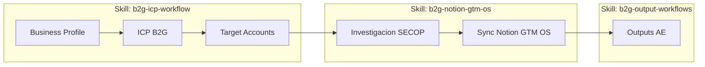

# Mapa de workflows B2G GTM

Este documento describe el flujo MVP end-to-end del toolkit: desde la definicion del ICP hasta la generacion de entregables para Account Executives, pasando por la investigacion SECOP y la sincronizacion con Notion.

## Diagrama

## Pasos del workflow

| # | Paso | Skill | Comando CLI | Entrada de ejemplo | Salida |
|---|---|---|---|---|---|
| 1 | Capturar Business Profile | [`skills/b2g-icp-workflow/SKILL.md`](../skills/b2g-icp-workflow/SKILL.md) | `b2g-gtm validate business-profile examples/business-profile.json` | [`examples/business-profile.json`](../examples/business-profile.json) | Business Profile validado |
| 2 | Derivar ICP B2G | [`skills/b2g-icp-workflow/SKILL.md`](../skills/b2g-icp-workflow/SKILL.md) | (skill genera el brief) | [`examples/business-profile.json`](../examples/business-profile.json) | [`examples/icp.json`](../examples/icp.json) |
| 3 | Generar Target Accounts | [`skills/b2g-icp-workflow/SKILL.md`](../skills/b2g-icp-workflow/SKILL.md) | `b2g-gtm validate target-accounts examples/target-accounts.json` | [`examples/icp.json`](../examples/icp.json) | [`examples/target-accounts.json`](../examples/target-accounts.json) |
| 4 | Investigar SECOP | [`skills/b2g-notion-gtm-os/SKILL.md`](../skills/b2g-notion-gtm-os/SKILL.md) | `b2g-gtm secop research --input examples/secop-research-input.json` | [`examples/secop-research-input.json`](../examples/secop-research-input.json) | `data/runs/<run-id>/secop-research.jsonl` |
| 5 | Verificar Notion (dry-run) | [`skills/b2g-notion-gtm-os/SKILL.md`](../skills/b2g-notion-gtm-os/SKILL.md) | `b2g-gtm notion verify` y `b2g-gtm notion setup --dry-run` | Manifiesto del workspace | Reporte de gaps de schema |
| 6 | Sync Notion | [`skills/b2g-notion-gtm-os/SKILL.md`](../skills/b2g-notion-gtm-os/SKILL.md) | `b2g-gtm notion sync --run <run-id>` | Salida de paso 4 | Paginas en Notion (Accounts / Opportunities / Research) |
| 7 | Outreach AE | [`skills/b2g-output-workflows/SKILL.md`](../skills/b2g-output-workflows/SKILL.md) | `b2g-gtm output create --type outreach --source examples/opportunity.json` | [`examples/opportunity.json`](../examples/opportunity.json) | Brief de cold email / LinkedIn |
| 8 | Meeting Prep AE | [`skills/b2g-output-workflows/SKILL.md`](../skills/b2g-output-workflows/SKILL.md) | `b2g-gtm output create --type meeting-prep --source examples/opportunity.json` | [`examples/opportunity.json`](../examples/opportunity.json) | Brief de discovery |
| 9 | Propuesta / Business Case | [`skills/b2g-output-workflows/SKILL.md`](../skills/b2g-output-workflows/SKILL.md) | `b2g-gtm output create --type proposal --source examples/opportunity.json` | [`examples/opportunity.json`](../examples/opportunity.json) | Brief de propuesta |

## Notas

- Los pasos 1-3 se hacen una sola vez por empresa; refrescar cuando cambie el portafolio.
- El paso 4 es repetible por cuenta o por keyword; cada ejecucion produce un `run-id` propio en `data/runs/`.
- El paso 5 valida el schema; el paso 6 escribe en Notion y requiere credenciales reales en `.env`.
- Los pasos 7-9 dependen de tener al menos una oportunidad investigada (con referencias a registros SECOP) en formato `Opportunity`.
- Para el detalle de instalacion del skill pack y cuando dispararlo, ver [`docs/agent-usage.md`](./agent-usage.md).
