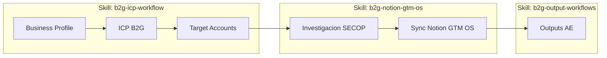

# Mapa de workflows B2G GTM

Este documento describe el flujo MVP end-to-end del toolkit: desde la definicion del ICP hasta la generacion de entregables para Account Executives, pasando por la investigacion SECOP y la sincronizacion con Notion.

## Diagrama

## Pasos del workflow

| # | Paso | Skill | Comando CLI | Entrada de ejemplo | Salida |
|---|---|---|---|---|---|
| 1 | Capturar Business Profile | [`skills/b2g-icp-workflow/SKILL.md`](../skills/b2g-icp-workflow/SKILL.md) | `b2g-gtm validate business-profile examples/business-profile.json` | [`examples/business-profile.json`](../examples/business-profile.json) | Business Profile validado |
| 2 | Derivar ICP B2G | [`skills/b2g-icp-workflow/SKILL.md`](../skills/b2g-icp-workflow/SKILL.md) | (skill genera el brief) | [`examples/business-profile.json`](../examples/business-profile.json) | [`examples/icp.json`](../examples/icp.json) |
| 3 | Generar Target Accounts | [`skills/b2g-icp-workflow/SKILL.md`](../skills/b2g-icp-workflow/SKILL.md) | `b2g-gtm validate target-accounts examples/target-accounts.json` | [`examples/icp.json`](../examples/icp.json) | [`examples/target-accounts.json`](../examples/target-accounts.json) |
| 4 | Investigar SECOP | [`skills/b2g-notion-gtm-os/SKILL.md`](../skills/b2g-notion-gtm-os/SKILL.md) | `b2g-gtm secop research --input examples/secop-research-input.json --to-notion --apply` | [`examples/secop-research-input.json`](../examples/secop-research-input.json) | Registros en `B2G SECOP Research` |
| 5 | Verificar Notion (dry-run) | [`skills/b2g-notion-gtm-os/SKILL.md`](../skills/b2g-notion-gtm-os/SKILL.md) | `b2g-gtm notion verify` y `b2g-gtm notion setup --dry-run` | Manifiesto del workspace | Reporte de gaps de schema |
| 6 | Importar workflow a Notion | [`skills/b2g-notion-gtm-os/SKILL.md`](../skills/b2g-notion-gtm-os/SKILL.md) | `b2g-gtm notion import-workflow --business-profile ... --icp ... --target-accounts ... --run <run-id> --apply` | Archivos de importacion | Paginas en Notion (Business Profile / ICP / Accounts / Research) |
| 7 | Outreach AE | [`skills/b2g-output-workflows/SKILL.md`](../skills/b2g-output-workflows/SKILL.md) | `b2g-gtm output create --type outreach --opportunity-page <page-id> --to-notion --apply` | Oportunidad en Notion | Output en `B2G GTM Outputs` |
| 8 | Meeting Prep AE | [`skills/b2g-output-workflows/SKILL.md`](../skills/b2g-output-workflows/SKILL.md) | `b2g-gtm output create --type meeting-prep --opportunity-page <page-id> --to-notion --apply` | Oportunidad en Notion | Output en `B2G GTM Outputs` |
| 9 | Propuesta / Business Case | [`skills/b2g-output-workflows/SKILL.md`](../skills/b2g-output-workflows/SKILL.md) | `b2g-gtm output create --type proposal --target-account-page <page-id> --to-notion --apply` | Cuenta objetivo en Notion | Output en `B2G GTM Outputs` |
| 10 | Importar markdown AE existente | [`skills/b2g-notion-gtm-os/SKILL.md`](../skills/b2g-notion-gtm-os/SKILL.md) | `b2g-gtm output import --type outreach --file output.md --target-account-page <page-id> --to-notion --apply` | Markdown local y relacion de Notion | Output en `B2G GTM Outputs` |

## Notas

- Los pasos 1-3 se hacen una sola vez por empresa; refrescar cuando cambie el portafolio.
- El paso 4 es repetible por cuenta o por keyword; el resultado real queda en Notion cuando se usa `--to-notion --apply`.
- Los archivos locales que se generen durante el paso 4 son artefactos de preview, importacion o diagnostico; no son el estado GTM reutilizable.
- El paso 5 valida el schema; el paso 6 importa material local existente a Notion y requiere credenciales reales en `.env`.
- Los pasos 7-9 dependen de tener al menos una oportunidad o cuenta investigada en Notion con referencias SECOP.
- El paso 10 es para migracion de markdown existente; por defecto previsualiza y solo escribe con `--apply`.
- Para el detalle de instalacion del skill pack y cuando dispararlo, ver [`docs/agent-usage.md`](./agent-usage.md).
